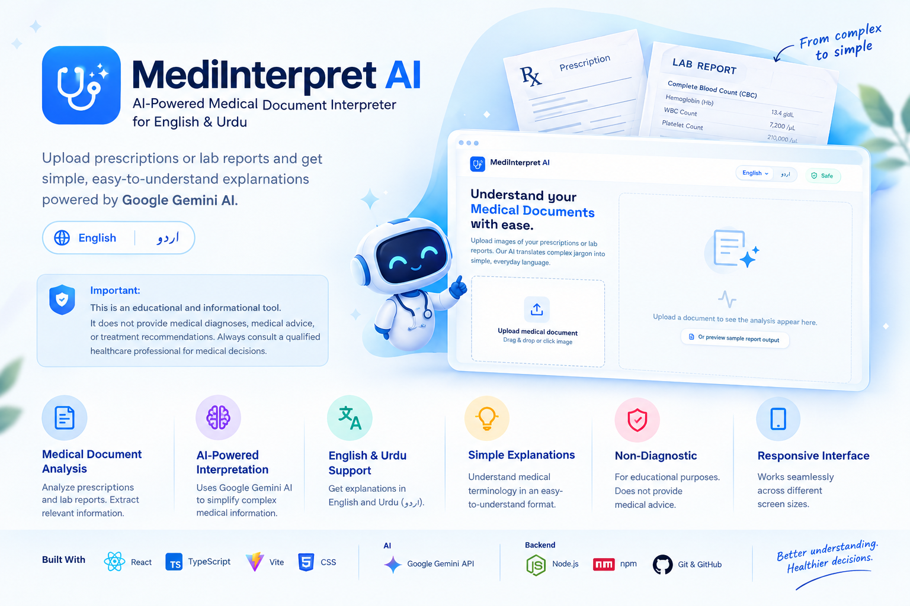

# 🩺 MediInterpret AI

### AI-Powered Medical Document Interpreter for English & Urdu



MediInterpret AI is a **non-diagnostic medical document interpretation application** designed to help users understand prescriptions and laboratory reports in simple, everyday language.

The application uses **Google Gemini AI** to analyze medical documents and provide simplified explanations of medical terminology and document information, with support for **English and Urdu (اردو)**.

> ⚠️ **Important:** MediInterpret AI is an educational and informational tool. It does **not** provide medical diagnoses, medical advice, or treatment recommendations. Users should always consult a qualified healthcare professional for medical decisions.

---

## ✨ Features

* 🧾 **Medical Document Analysis**

  * Analyze medical documents such as prescriptions and laboratory reports.
  * Extract relevant information for easier understanding.

* 🤖 **AI-Powered Interpretation**

  * Uses Google Gemini AI for document understanding.
  * Converts complex medical information into simpler explanations.

* 🌐 **English & Urdu Support**

  * Provides explanations in English.
  * Supports Urdu (اردو) for improved accessibility.

* 📋 **Simple Explanations**

  * Helps users understand medical terminology and document information.
  * Presents information in an easy-to-understand format.

* ⚕️ **Non-Diagnostic**

  * Designed for informational and educational purposes.
  * Does not replace professional medical advice.

* 📱 **Responsive Interface**

  * Designed for use across different screen sizes.

---

## 🛠️ Tech Stack

### Frontend

* React
* TypeScript
* Vite
* CSS

### AI

* Google Gemini API

### Development

* Node.js
* npm
* Git & GitHub

---

## 🚀 Getting Started

### Prerequisites

Make sure you have the required development tools installed:

* Node.js
* npm
* Git

### Clone the Repository

```bash
git clone https://github.com/NehaFahim/MediInterpret-AI.git
```

Navigate to the project directory:

```bash
cd mediinterpret-ai
```

### Install Dependencies

```bash
npm install
```

### Environment Configuration

The application requires the appropriate **Google Gemini API configuration**.

Create the required environment configuration based on the variables used by the project.

> ⚠️ Never commit API keys or other sensitive credentials to GitHub.

### Run the Application

Start the development server using the project's configured development command:

```bash
npm run dev
```

---

## 🧠 How It Works

MediInterpret AI follows a simple workflow:

```text
Upload Medical Document
          ↓
   Document Processing
          ↓
      Gemini AI
          ↓
Medical Information Analysis
          ↓
Simplified Explanation
          ↓
 English / Urdu Output
```

The application aims to make medical documents easier for general users to understand by presenting complex medical information in simpler language.

---

## 🌐 Language Support

### 🇬🇧 English

Medical information can be explained using simple and accessible English.

### 🇵🇰 اردو

The application also supports explanations in Urdu (اردو), helping make medical information more accessible to Urdu-speaking users.

---

## ⚕️ Medical Safety & Disclaimer

MediInterpret AI is **not a medical diagnostic system**.

The application:

* Does not diagnose diseases.
* Does not replace doctors or healthcare professionals.
* Does not prescribe medication.
* Does not determine treatment plans.
* Should not be used for emergency medical decisions.
* Should not be considered a substitute for professional medical advice.

AI-generated interpretations may contain errors or misunderstandings.

> **Always verify important medical information with a qualified healthcare professional.**

### 🚨 Emergency Situations

If you are experiencing a medical emergency, seek immediate professional medical assistance instead of relying on this application.

---

## 🔒 Privacy

Medical documents may contain sensitive personal information.

Users should avoid uploading unnecessary personally identifiable information whenever possible.

For production use, appropriate security, privacy, access-control, data-retention, and regulatory requirements should be carefully considered before handling real patient information.

---

## 🎯 Project Goals

MediInterpret AI was created with the following goals:

1. Make medical documents easier to understand.
2. Simplify complex medical terminology.
3. Improve accessibility through Urdu language support.
4. Explore practical applications of multimodal AI.
5. Provide an educational, non-diagnostic AI experience.
6. Explore responsible AI usage in healthcare-related applications.

---

## 🔮 Future Improvements

Potential improvements may include:

* 📄 Support for additional medical document formats
* 🌍 Additional language support
* 🧠 Improved document understanding
* 📊 Enhanced laboratory-result explanations
* 📱 Improved mobile experience
* 🔐 Enhanced privacy and security
* 📑 Medical document history
* 🔎 Improved extraction of individual test values
* 🧾 Improved prescription formatting
* ♿ Additional accessibility improvements

---

## 🤝 Contributing

Contributions, suggestions, and improvements are welcome.

To contribute:

```bash
git clone https://github.com/NehaFahim/MediInterpret-AI.git
cd mediinterpret-ai
npm install
```

Create a feature branch:

```bash
git checkout -b feature/your-feature-name
```

Make your changes, test them, and submit a pull request.

---

## 📜 License

This project is intended for educational and development purposes.

If this repository is released under the MIT License, include the appropriate MIT License text here.

---

## 👩‍💻 Author

**Neha Fahim**

**Full-Stack & AI Developer**
**Co-Founder — Zandrelix**

🌐 Portfolio: https://nehafahim.vercel.app

---

## ⭐ Support the Project

If you find MediInterpret AI useful or interesting:

* ⭐ Star the repository
* 🍴 Fork the project
* 🐛 Report issues
* 💡 Share suggestions
* 🤝 Contribute improvements

---

<div align="center">

### 🩺 MediInterpret AI

**Making medical information easier to understand — one document at a time.**

</div>
